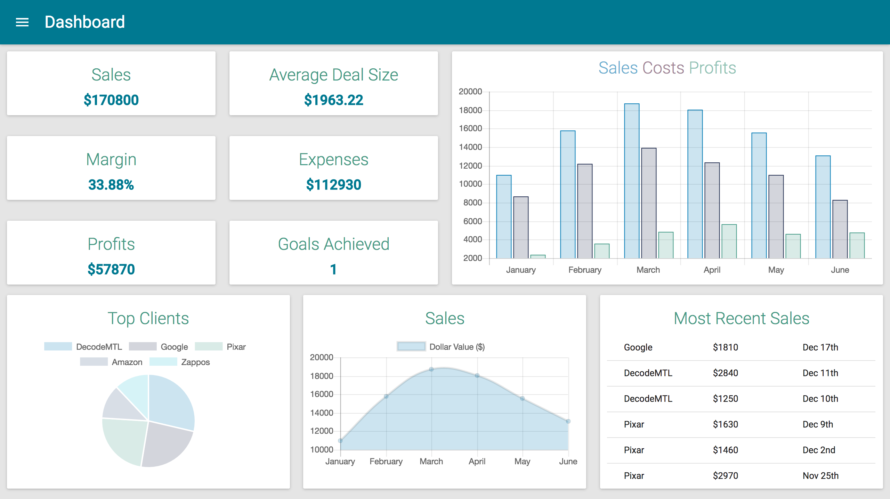

# Sales bot

Sales-Dashboard-react is a complete application which works like a dashboard for tracking key sales metrics and performance indicators. With a simple interface, this dashboard can help you track and display your sales activity online.


## Installation

```
$ git clone https://github.com/sales-assistant-bot/sales-dashboard-react
$ npm install .
```

## Usage
```
$npm start
```


## Contributing

1. Fork it!
2. Create your feature branch: `git checkout -b my-new-feature`
3. Commit your changes: `git commit -am 'Add some feature'`
4. Push to the branch: `git push origin my-new-feature`
5. Submit a pull request :D

## Examples



## History

TODO: Write history

## Authors

* [Anthony Desormeau](https://github.com/ajdez)
* [Randy Klose](https://github.com/Randyklose)
* [Joseph Melanson](https://github.com/joemelanson)

## License

TODO: Write license
